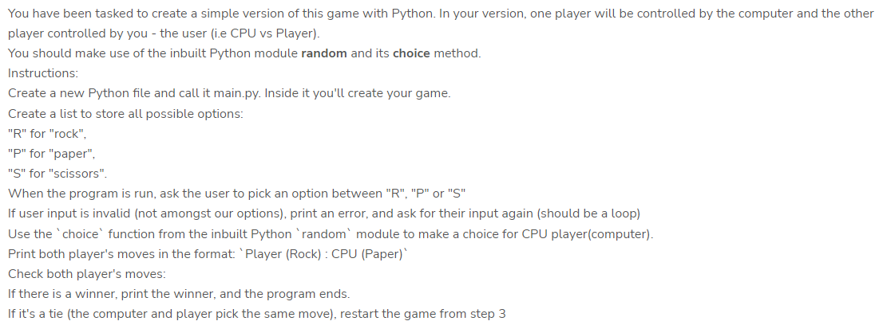

# About the project

The project is a **Rock Paper Scissors** game built on python. For anyone who might be unfamiliar, here's a brief explanation of the game:

Rock Paper Scissors is a hand game originating from China, usually played between two people, in which each player simultaneously forms one of three shapes with an outstretched hand. These shapes are "rock" (a closed fist), "paper" (a flat hand), and "scissors" (a fist with the index finger and middle finger extended, forming a V).

There are three possible outcomes: a tie, a win or a loss. A player who decides to play rock will beat another player who has chosen scissors ("rock crushes scissors"), but will lose to one who has played paper ("paper covers rock"); a play of paper will lose to a play of scissors ("scissors cuts paper"). If both players choose the same shape, the game is tied and is usually immediately replayed to break the tie.

Below is a pictoral representation of the game:

*Image source: pinterest*

## The project motivation

This project is a task from a web development training that I currently undergo, it came with a couple of instructions for implementation.



## Walking you through the code

Upon running the code, a couple of information are displayed to the player using the print() function. The code also contains a list named 'options'. This list holds the values representing the initials of Rock Paper Scissors (R,P,S) which the player will choose from and from which will also be assigned randomly to the computer with the help of the random.choice() method earlier imported.

```python
import random
print("Hi! Welcome to the 'ROCK PAPER SCISSORS' game. Just a few rules:\n ROCK beats SCISSORS\n SCISSORS beats paper \n PAPER beats ROCK ")
print("-----------------------------------------------------------------------")
print("In this game:\n R will denote ROCK \n P will deonte PAPER\n S will denote SCISSORS" )
print("-----------------------------------------------------------------------")
print("Your opponent will be the computer.") 
print("-----------------------------------------------------------------------")
print("NOW LET'S PLAY!")
options=['R','P','S']
```

The program consists of a while loop, nested within the while loop, are some if statements. The first if statement serves the purpose of ensuring that only valid options are recieved from the user. The next if statement which is nested within the first, is used to display winners for situations where there is no tie. Nested within this if statement are; one if statement, 2 elif statements and a final else condition. The purpose of the if and **elif**s is to provide conditions for the three possible outcomes of the Computer. The else statement has a *pass* within it because all the three statements above it have satisfied all possible outcomes of the Computer variable.

```python
i=0
while i>=0:
    Computer= random.choice(options)
    Player=input("Enter your option from : R, P or S (make sure it's in uppercase) \n")
    if Player in options: 
        print("Computer","(",Computer,") :","Player","(", Player,")")
        if Computer!= Player:
            if Computer==options[0]:
                #for R
                if Player==options[1]:
                    #for P
                    print("You win!")
                    break
                elif Player==options[2]:
                    #for S
                    print("Computer wins!")
                    break
            elif Computer==options[1]:
                #for P
                if Player==options[0]:
                    #for R
                    print("Computer wins")
                    break
                elif Player==options[2]:
                    #for S
                    print("You win")
                    break   
            elif Computer==options[2]:
                #for S
                if Player==options[0]:
                    #for R
                    print("You win!")
                    break
                elif Player==options[1]:
                    #for P
                    print("Computer wins!") 
                    break 
            else: #not necessary
                pass    
        else:
            print("Oops! looks like it's a Tie. Let's try again")           

    #there should be an else for when both options are the same , print its a tie.
    else:
        #this is where I print error should be at the end of the loop to match my begining if condition. 
        print("Invalid input.")

    i+=1 
```

After every if and elif statement, the purpose of putting a *break* is to bring the game to an end if a result is obtained within that statement, thereby preventing the loop from continuing.

The else statement before the last solves the problem of *ties* betwen the player and the computer. By not putting a break, the loop runs again from the start, which is exactly the desired behaviour; for the player to re-enter a value and the Computer to be re-assigned another.

The final else statement is executed if the player enters an invalid output, this like the one before it will cause the loop to start again.
  
Below are links to some YouTube videos that i found helpful:

- A video on [for else](https://youtu.be/38svC3U7hVo)

- A video on [execution flow and loops](https://youtu.be/CLHCeT2pRwA)

- A video on [break continue and pass](https://youtu.be/JCRpVwtVL4I)

- Another video on [break continue and pass](https://youtu.be/yCZBnjF4_tU)

- A video on [if elif and else statements](https://youtu.be/PqFKRqpHrjw)

- A video on [for loop](https://youtu.be/0ZvaDa8eT5s)

- A video on [while loop](https://youtu.be/HZARImviDxg)

Videos on random.choice() method:

- <https://youtu.be/8YZCE4U_4gg>

- <https://youtu.be/Ac1vF1rxd2k>

- <https://youtu.be/pt3k8pc8f0A>

Read more about Rock Paper Scissors on [wikipedia](https://en.wikipedia.org/wiki/Rock_paper_scissors)

Check out the website of the organisers of my training [here.](https://zuri.team/)
